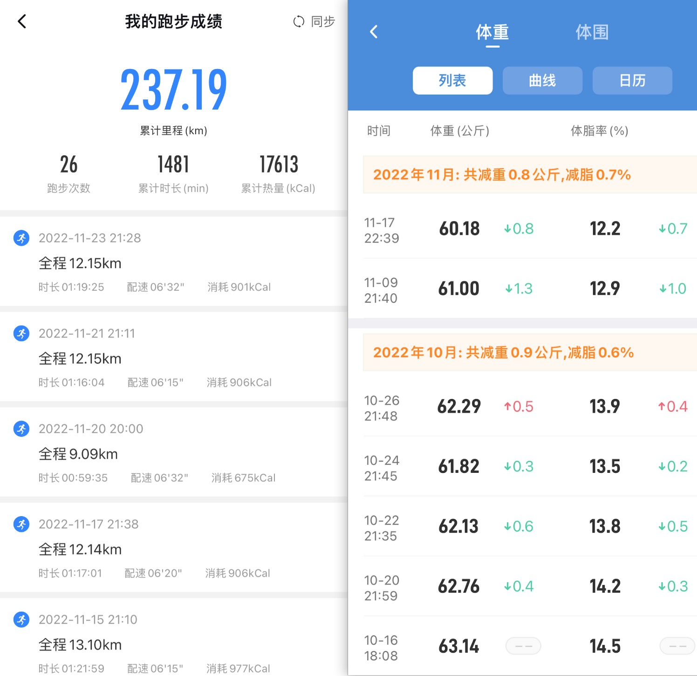
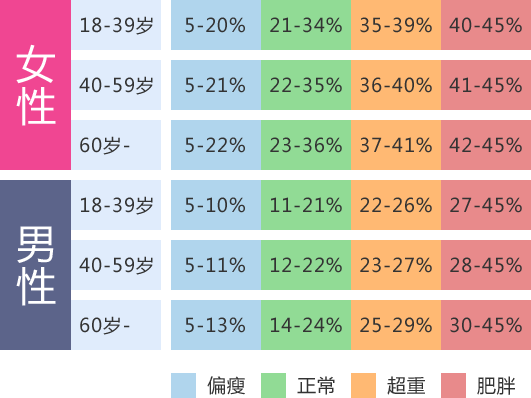

# 学习健身（Learn Fitness）

## 为何要学习健身
社会要发展，科技要进步，GDP要增长，男性要养家庭，女性要爱美。

人活在世上，几乎不可能做到无欲无求。无论你是为了提升身体素质还是为了自身可持续发展，你都需要学习健身。

其实，大部分人都只是为了更好地生活而努力活着。你现在或许有很好的精力和赚钱能力，但三年后、五年后以及有家庭、有贷款后呢？你的工作是否不会损耗你的身体？
你的家庭是否不会消耗你的精力？除此之外你就没有别的梦想了吗？假设，我是说假设，你坚持健身了三年，能穿得一身挺拔西装，脱掉衣服至少有六块腹肌，
那么你走到任何场合还是否还会毫无存在感呢？**男人至死是少年，少年，健身吧！**

**健身磨炼心性**。无论你现在是自卑、做事三分钟热度、不甘心甘于平淡的自己等等，你也希望改变自己，但苦于没有人带动你，没有好的方法，
那么我推荐你开始健身吧！健身是一个长期的、持续性的过程，这个过程中你会体验到体重从刚开始的起起落落，逐渐变为掉秤十几斤甚至几十斤。
健身也是一门学问，不是无脑锻炼就可以达到目的的，所以等你坚持下来，掌握健身，掌握其中的知识，你自身的心性也会得到提升。

**不是八块腹肌才叫健身成功**。很多人会产生一个误解，认为坚持了几个月或一年的健身没有达到八块腹肌或者说体脂率没有掉的很多，就认为健身太难，无法坚持。
其实不然，倘若你真的坚持下来（至少每周都有3次以上的健身训练），不需要太久，坚持1个月你就能看到自己的体脂率变化（体重会掉的更明显）。以笔者为例（173cm/132斤），
在以2天跑步一次的频率坚持1个半月后，体重掉秤10斤（现保持121\~122斤），没有任何节食行为。贴图为证（早期体重由于称未到所以未记录）

当然，这里不是说就推荐跑步作为健身计划，只是举个实际案例作为参考。具体每个人的健身计划是根据个人情况可能不同的。

**壮硕的身体素质，与不讲道理的人讲道理**。你可以执行更专业的健身计划，比如使用哑铃、杠铃等专业器具，并购买蛋白粉肌酸等辅助健身饮食，帮助你打造更壮硕的身体。
虽然法律不推荐用👊🏻解决问题，但必须要承认的是，在遇到大多数生活中的小事的时候，比如遭遇插队、碰撞、路怒症等情况，**壮硕强健的身体有时能帮你做到不战而屈人之兵**。
但你若没有，就只能受欺负，这是没有任何办法的，这也是一种弱肉强食的弱化表现。

## 认识体脂率
体脂率是衡量人体肥胖的最佳标准，所以这里将大部分人的身体情况根据体脂率简单分为三类：体脂率低、体脂率标准和体脂率高。下面通过一张图来简单认识年龄与体脂率的对应关系：

其中，「偏瘦」可以认为是经常健身的人的体脂率范围，而大部分人都是在「正常」这个档位。**但是，如果你想要使身体更加健康，并且「穿衣显瘦，脱衣有肉」，那就尽量使自己进入偏瘦这个档位**。

体脂率的测量可以简单通过市面上￥50+的**体脂称**来测量，另外还可购买较专业的**体脂测量仪**（通常价格￥100+）进行测量。对于多数朋友，体脂称够用。

>注意，购买体重秤或体脂称的时候不要贪图便宜，经笔者实测，部分较便宜（￥10~30内）的称测量的体重数据在无进食的几小时内是波动的，不准确。一个测量不准确的称会严重影响你的健身心态。

## 如何制定计划
TODO

